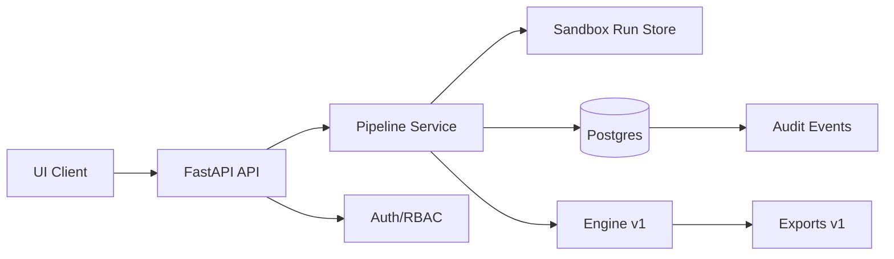
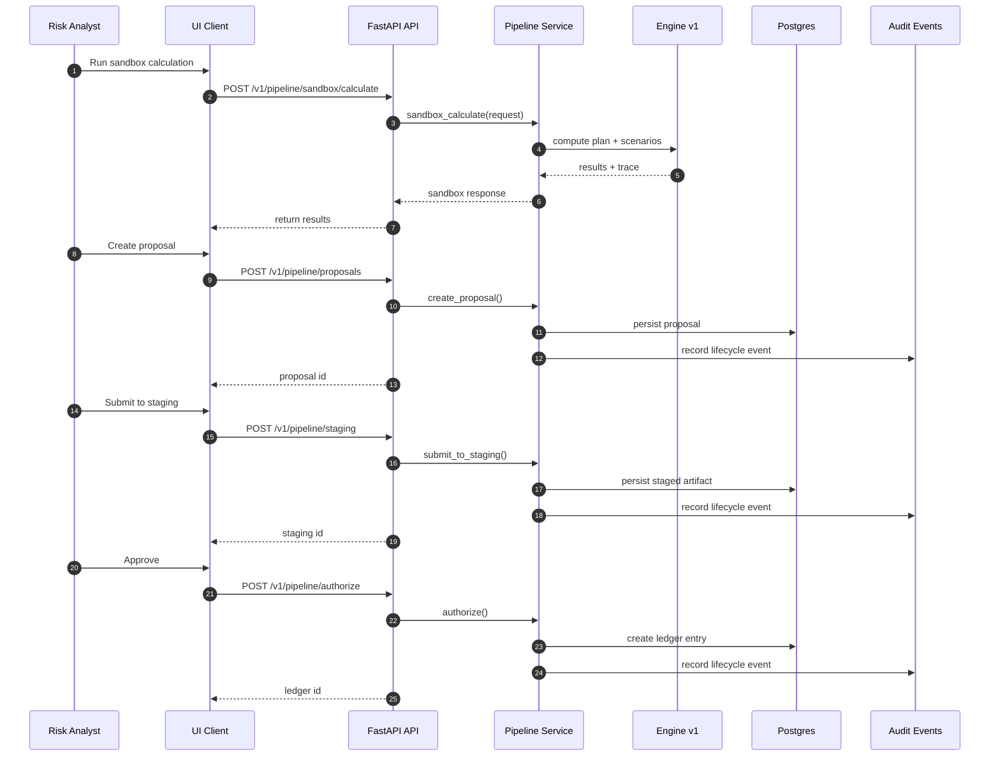

# Governance pipeline flow

## Actors
- Risk analyst
- Supervisor approver
- Ledger/audit system

## Component diagram

## Sequence diagram

## Steps
1. Analyst runs SANDBOX calculations and saves proposals.
2. Items move to STAGING for review and approval.
3. Approved items are committed to LEDGER.
4. Audit logs and policy revisions are recorded.

## Key endpoints
- `/v1/pipeline/*`
- `/v1/proposals/*`
- `/v1/policies/revisions/*`
- `/v1/audit/*`

## Notes
- Use SANDBOX for experimentation; LEDGER is immutable.
