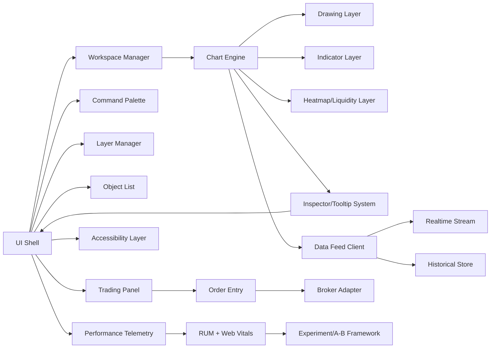
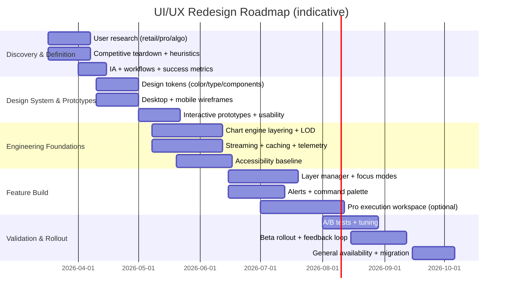

# Deep UI/UX Redesign Research for a Professional Charting Platform That Can Beat TradingView

## Executive summary

A TradingView-beating experience is less about “more indicators” and more about **decision velocity**: how quickly (and confidently) a trader can (a) orient, (b) form a hypothesis, (c) validate it with complementary data layers, and (d) act—without visual noise, interaction friction, or performance jank. Research on interactive visual analysis repeatedly finds that **fluent interaction** and **low-latency, comprehensible controls** expand the depth and quality of analysis, while confusing controls and slow response times curtail it. citeturn8view2turn8view1

From your EUR/USD daily-chart screenshot, the core feature set is already strong (candles, EMAs, trendlines, FVG, liquidity/heatmap bands, pivots, annotations, dark theme). The primary UX bottleneck is that the chart reads like “everything at once”: the heatmap and overlays dominate the visual field, reducing candle/structure legibility and making it hard to quickly answer trader-critical questions (“Where is price relative to the only levels that matter *right now*?”). This is a **visual hierarchy and layer-governance problem**, not a feature deficit.

To beat TradingView in practice, your redesign should emphasize four differentiators:

1. **Layer governance + progressive disclosure by intent**: “Overview first, zoom/filter, details-on-demand” applied directly to chart overlays, not just datasets. citeturn8view0turn8view1  
2. **Pro-grade execution workspace (optional)** that matches thinkorswim’s strengths (DOM/ladder + one-click workflows) while keeping TradingView’s approachability. citeturn10search7turn10search1  
3. **Order-flow + liquidity visualization that stays readable** (heatmap/footprints/DOM) with controls that prevent visual domination, leveraging the idea that heatmaps reveal liquidity behavior—but only if the display remains interpretable. citeturn1search32turn11search1  
4. **Performance and responsiveness as a product feature**: predictable 60fps interactions, streaming-first architecture, and off-main-thread rendering so the UI remains fluid during volatility. citeturn4search0turn4search13turn4search2  

The rest of this report gives: (a) a strict UI audit of what’s visible now, (b) a competitor matrix (TradingView + thinkorswim + MetaTrader 5 + TradingLite + your current platform), (c) research-backed best practices (visualization, accessibility, performance, responsive), (d) proposed layouts/wireframes and interaction flows, and (e) an implementation + rollout blueprint with KPIs and A/B tests.

## Current chart UI audit

### Visible elements and current information architecture

Based on the screenshot (EUR/USD, daily), these elements are visibly present:

- **Global top bar / header**
  - Brand (“ORDR”), product context (“Market”), plan badge (“Free”)
  - Symbol selector (EUR/USD)
  - Price + percent change, and an OHLC-style readout (values appear near the instrument)
  - Quick timeframe switching (e.g., 1m, 5m, 15m, 1H, 4H, 1D, 1W)
  - Session/data status indicator: “twelvedata” + “delayed” (suggesting the feed is delayed)
  - Sign-in entry point (top right)

- **Chart-type row**
  - Candles selected plus other rendering styles (bars/line/area variants)

- **Feature toggles row**
  - Groups like MA/EMA, Bands, Oscillators, Volume
  - Strategy/overlay toggles: S/R, FVG, Trendlines, Pivot
  - Drawing tool shortcuts (line/horizontal, fib, rectangle, clear)

- **Left vertical toolbar**
  - Crosshair/select
  - Pointer/selection tool
  - Multiple drawing tool icons (trendline variants, shapes)
  - Text/annotation tool(s)
  - Ancillary icons near bottom (zoom, etc.)

- **Main chart canvas**
  - Candlestick series (low-saturation/gray)
  - EMA (strong purple line)
  - Multiple diagonal trendlines (thin red)
  - Liquidity heatmap bands / horizontal density stripes (red and teal/green)
  - Pivot lines (red dashed horizontals)
  - FVG labels/blocks (small “FVG” labels at multiple points)
  - Crosshair & hover line (dotted)

- **Axes and footer**
  - Right price scale with current price marker
  - Bottom time scale with dates
  - Footer status strip (market open + session/timezone text)
  - Scale toggles (“Linear”) + small action icons (camera/share/settings-like)

### Usability issues and risk points

**Layer competition & clutter**
- The **liquidity heatmap occupies almost the entire vertical span with dense banding**, which competes directly with candles, pivots, FVGs, and the EMA. When multiple encodings overlap (stripes + dashed lines + labels + candles), the user’s *visual parsing time* increases sharply—especially on a daily chart where structure (swing highs/lows, breaks) is the primary read. This violates the practical application of “overview first… details-on-demand” because the “overview” is already saturated. citeturn8view0turn8view2  
- There is no clearly visible **layer manager** (order, opacity, grouping, “solo/mute”), which is the standard mechanism in complex visual analytics tools to prevent overlays from becoming a single blended mass. The importance of interaction design (not just static visuals) is a central point in visualization research: confusing controls and hidden operations reduce analysis depth. citeturn8view2  

**Discoverability vs. expert efficiency**
- The left toolbar is icon-heavy with no labels. Icon-only toolbars can work for experts, but they require **reinforcement through tooltips, affordances, and accelerators** so novices aren’t forced to memorize. NN/g’s usability heuristics emphasize recognition over recall and efficiency accelerators for expert users. citeturn13search0turn13search1  
- Your feature toggles are compact, but statefulness is unclear: some buttons look like pills with subtle color dots; it’s hard to tell what is active, what has sub-settings, and what has multiple instances.

**Data status and trust**
- The feed status “delayed” is visible but not operationalized. In trading contexts, **data freshness is a trust primitive**: users should instantly know what is delayed, by how much, and what upgrades/fallbacks exist. Twelve Data documents that candle availability can lag after close due to processing and storage steps, with typical delays on the order of seconds to minutes depending on instrument and pipeline. citeturn2search2  
- If you rely on delayed feeds in a free tier, the UI should treat this like a “safety label,” not a small badge: clear tooltip, latency estimate, and a one-click “switch provider / upgrade / connect broker feed.”

**Interaction affordances**
- For drawings (trendlines, rectangles, FVG zones), the screenshot doesn’t show obvious **selection handles, hover states, or object editing affordances**. Professional users expect direct manipulation: click-to-select, handles for endpoints, drag-to-adjust, lock/unlock, and object lists/history (undo/redo + versioned layouts). The visualization literature explicitly calls out “record, annotate, share” as core analytic dynamics. citeturn8view2turn7view1  

### Visual hierarchy, color/contrast, and cognitive load

**Hierarchy**
- The EMA (bright purple) is the most salient single element besides the heatmap; candles are comparatively subdued. This puts the user’s attention on the moving average curve rather than price structure—sometimes desirable, but it should be a user choice via emphasis controls (e.g., “focus candles” mode, auto-thin overlays on hover, or per-layer salience sliders).

**Contrast**
- Dark themes can be excellent for prolonged use, but must maintain readability and legibility. WCAG emphasizes adequate contrast for text and discernibility, and prohibits color-only encoding for meaning without alternatives (patterns, labels, second encodings). citeturn1search3turn5search23turn5search8  
- Heatmap red/green reliance risks color-vision issues unless you offer colorblind-safe palettes and/or texture/pattern alternatives for key states. WCAG technique guidance explicitly recommends pairing color differences with patterns for non-text information. citeturn5search23  

**Clutter mechanics**
- Your chart is functionally “multi-signal.” What’s missing is **multi-signal governance**:
  - A *global clutter governor* (auto-dim, collapse labels, LOD rules based on zoom)
  - Scoped “analysis intents” (Structure / Liquidity / Indicators / Execution) where only relevant panels and layers are foregrounded

## Competitive landscape analysis

### What “winning” means in this competitive set

- TradingView’s moat is **breadth + community + ease**: scripts, ideas, alerts, multi-device, and broker connectivity. Its Pine Script ecosystem is massive and explicitly designed for custom indicators/strategies. citeturn6search0turn6search1turn0search0  
- thinkorswim’s moat is **broker-native pro workflows** (ladder/DOM, one-click trade entry, deep customization, and a mature desktop). citeturn10search7turn10search1turn9view3  
- MetaTrader 5’s moat is **broker distribution + automation + copy signals** and a built-in strategy tester workflow. citeturn9view2turn6search12turn6search20  
- TradingLite’s moat is **order-flow + liquidity visualization** as a primary experience, with product messaging focused on performance/efficiency and an order-book-centered toolset. citeturn9view0turn11search1turn9view1  
- Your platform’s advantage (based on screenshot) can be **liquidity-first FX charting** with modern UX and TradingView-like approachability—if you solve readability and workflow depth.

image_group{"layout":"carousel","aspect_ratio":"16:9","query":["TradingView Supercharts dark mode interface screenshot","thinkorswim desktop chart interface Active Trader ladder screenshot","MetaTrader 5 desktop platform chart interface dark theme screenshot","TradingLite heatmap order flow interface screenshot"],"num_per_query":1}

### Comparison table

**Notes on methodology:** The table emphasizes publicly documented capabilities and positioning, not subjective “better/worse.” Pricing and feature lists change frequently; all pricing statements are “as published” on the cited pages at the time of this report.

| Platform | Strength profile | Customization & extensibility | Social / copy | Trading / execution | Mobile–desktop parity | Pricing snapshot |
|---|---|---|---|---|---|---|
| TradingView | Broad charting + screening + community; strong alerts and broker connectivity. citeturn0search4turn12search18turn12search13 | Pine Script for custom indicators/strategies; large community script ecosystem. citeturn6search0turn6search5 | Social network + idea publishing and follower notifications. citeturn6search1turn6search11 | Can trade from charts by connecting supported brokers/exchanges; TradingView acts as interface. citeturn12search5turn12search18 | Explicit web/desktop/mobile support listed in plan matrix. citeturn0search0 | Essential/Plus/Premium/Ultimate tiers (e.g., Essential ~$12.95/mo billed annually; Ultimate ~$199.95/mo billed annually on the pricing page). citeturn0search0 |
| thinkorswim | Broker-native, pro trading workflows; Active Trader ladder (DOM) + one-click entry; deep tools. citeturn10search7turn10search1 | thinkScript for custom studies/strategies/columns. citeturn0search37 | Limited “social network” compared to TradingView; more tool-centric than community-centric (no comparable built-in idea network on official pages). citeturn0search13turn9view3 | Built for trade execution inside the platform; ladder and order tools documented. citeturn10search13turn10search15 | Mobile app described as having most of the same features/functionality. citeturn0search29 | Access “for no charge” for Schwab clients; standard trade pricing applies. citeturn9view3turn0search5 |
| MetaTrader 5 | Multi-asset trading platform with marketplaces, signals, and automation ecosystem. citeturn9view2 | MQL5 ecosystem + Market; built-in Strategy Tester for testing/optimization. citeturn6search12turn6search20turn9view2 | Copy trading via signals is a first-class feature. citeturn9view2 | Primarily broker-connected execution; designed for trading operations. citeturn0search2turn9view2 | Mobile trading is explicitly part of the product navigation and supported apps exist. citeturn9view2turn0search26 | Described as a free application to download; trading costs depend on broker. citeturn0search2turn9view2 |
| TradingLite | Order-flow / liquidity visualization, heatmaps, footprints; product messaging emphasizes performance and web-based delivery. citeturn9view0turn11search1turn9view1 | LitScript language + reference docs; community/official indicators; plan tier limits for indicators/layouts. citeturn6search4turn9view1 | Community exists (Discord/feedback), but not positioned like TradingView’s public social network. citeturn9view0 | Primarily analysis tooling; the pricing/features page focuses on data/timeframes/heatmap/order-flow suite rather than brokerage execution. citeturn9view1turn11search1 | Web-based platform focus; cross-device details vary by implementation. citeturn9view0 | Public tiers shown (Trial/Silver/Gold; Silver $12.95/mo, Gold $20.95/mo). citeturn9view1 |
| ORDR (current screenshot baseline) | Liquidity heatmap + FX technical overlay stack; TradingView-like layout approach (top controls + left tool rail). | Appears to support multiple overlays and drawings; extensibility beyond built-ins not visible in screenshot. | Social/copy not visible in screenshot. | Order entry/DOM not visible in screenshot. | Mobile parity unknown from screenshot. | “Free” badge shown; data appears sourced from Twelve Data with “delayed” indicator. citeturn2search2 |

### Key competitive takeaways

- TradingView wins on **ecosystem** (community + scripting + broker connectivity + multi-device). citeturn6search0turn12search18turn0search0  
- thinkorswim wins on **execution workflow density** (ladder/DOM mechanics, presets, grid layouts) which is explicitly documented. citeturn10search7turn10search1turn10search15  
- MetaTrader 5 wins on **automation + distribution**: strategy testing/optimization and copy signals are core platform pillars. citeturn6search12turn9view2  
- TradingLite wins on **liquidity visualization depth** and ongoing infrastructure focus for throughput and reliability. citeturn11search1turn9view0  
- Your fastest path to “beat TradingView” is not copying breadth—it’s achieving **clarity + pro workflow + liquidity-first differentiation** while maintaining TradingView-level usability.

## Research-backed best practices and persona-based prioritization

### Visualization and interaction principles to apply directly to charting

1. **Overview → zoom/filter → details-on-demand** should be implemented as literal UI mechanics:
   - Overview: clean candles + minimal key levels  
   - Zoom/filter: bring layers in only when needed (or when zoomed enough)  
   - Details-on-demand: hover/inspect panels that don’t permanently clutter the canvas  
   This framing is explicit in Shneiderman’s visualization work. citeturn8view0turn8view1  

2. **Interaction fluency is a first-order feature**: visualization research argues that slow response times and confusing widgets reduce analysis quality; analytic tools must support interaction rates aligned with human thought. citeturn8view2  

3. **Preattentive properties + disciplined encodings**:
   - Use position/length for quantitative interpretation and be careful with color saturation and competing hues; dashboard visualization guidance emphasizes using encodings that match human cognition. citeturn5search1  
   - For chart UI, *candles and key levels* should remain the primary positional encoding, with heatmaps as a secondary layer whose intensity is bounded.

4. **Market-depth / heatmap interpretation must remain legible**:
   - Heatmaps can reveal liquidity behavior and resting orders, but only if the surrounding UI doesn’t destroy signal salience. citeturn1search32turn11search1  

### Accessibility requirements that matter for trading UIs

Even “pro” trading tools benefit from accessibility compliance because it improves clarity and reduces fatigue.

- **WCAG 2.2** is the clearest baseline for web and hybrid UIs, explicitly covering accessibility across device types. citeturn1search3  
- **Focus visibility and focus appearance** matter for power users and keyboard-first workflows; WCAG’s understanding guidance emphasizes clear, discernible focus indicators. citeturn1search21turn1search0  
- **Contrast and non-color encodings**:
  - WCAG contrast guidance underscores adequate contrast for readability. citeturn5search8  
  - WCAG techniques recommend combining **color + pattern** when color conveys meaning, applicable to heatmap bands and state encoding. citeturn5search23  
- Practical chart accessibility guidance also recommends patterns/textures, keyboard navigation, and avoiding clutter. citeturn5search17turn5search0  

### Performance best practices for real-time charting

- Real-time UIs commonly use **bidirectional streaming**; the WebSocket API is explicitly designed for two-way, persistent connections without polling. citeturn4search0  
- **Off-main-thread rendering**: OffscreenCanvas can move rendering work into workers to reduce main-thread blocking. citeturn4search1turn4search13  
- Animation timing should use **requestAnimationFrame** to sync updates to repaint. citeturn4search2turn4search6  
- For responsiveness targets, modern performance guidance references interaction latency expectations (e.g., INP-style thinking) and highlights long frames as a usability risk. citeturn4search26turn4search18  

### Feature prioritization by persona

Below is a **priority-by-persona** map designed to guide what ships first (and what becomes “advanced mode”).

**Retail discretionary trader (mobile + desktop)**
- Highest priority: onboarding clarity, templates, quick symbol/timeframe switch, clean overlays, alert creation, watchlists, layout saving, and *explainable* liquidity overlays.
- “Beat TradingView” lever: less clutter, faster comprehension, better defaults, simpler risk visualization.
- Essential competitive anchor: robust alerts + multi-device continuity (TradingView’s alerts and multi-device positioning are explicit). citeturn12search13turn0search0  

**Professional discretionary trader (multi-monitor, execution-heavy)**
- Highest priority: multi-layout workspaces, object/layer manager, hotkeys, DOM/ladder, bracket orders, orders-on-chart, and low-latency interaction patterns (thinkorswim ladder flows are heavily documented). citeturn10search7turn10search15  
- “Beat TradingView” lever: deliver *pro workflow density* without UI chaos.

**Algo/systematic trader (automation + reproducibility)**
- Highest priority: deterministic backtesting/replay, indicator versioning, strategy packaging, programmatic APIs, export pipelines.
- Competitive anchor benchmarks:
  - MetaTrader 5’s built-in strategy tester positioning and multi-currency testing/optimization narrative. citeturn6search12turn6search20  
  - TradingView’s scripting model for indicators/strategies at scale. citeturn6search0turn6search26  

## Proposed UI/UX architecture and layouts

### North-star UX concept

**Three-mode workspace model** (without forcing mode walls):

- **Analyze** (default): clean chart + layers; minimal UI chrome
- **Execute** (optional): DOM/ladder + order ticket + positions/risk panels
- **Automate** (optional): strategy/replay/backtest + alerts + scripting

This directly operationalizes the visualization interaction taxonomy: visualize/filter/navigate/coordinate views + record/annotate/share. citeturn8view2  

### Desktop wireframe

```
┌──────────────────────────────────────────────────────────────────────────────┐
│ Top Bar: [Symbol Search] [TF] [Layout▼] [Workspace▼] [Data: Live/Delayed]     │
│          [Connect Broker] [Alert] [Share] [Settings] [Profile]               │
├───────────┬───────────────────────────────────────────────┬─────────────────┤
│ Tool Rail │                 Chart Canvas                   │ Right Rail      │
│ (draw)    │  - candles + overlays                          │ Tabs:           │
│           │  - crosshair + inspector                        │  Watchlist      │
│           │  - overlay legend (compact)                     │  Layers         │
│           │  - mini timeline / replay scrub (toggle)        │  Objects        │
│           │                                               │  Alerts         │
│           │                                               │  Order Ticket   │
│           │                                               │  DOM / Depth    │
├───────────┴───────────────────────────────────────────────┴─────────────────┤
│ Bottom Bar (collapsible drawer): Orders | Positions | News | Strategy | Logs  │
└──────────────────────────────────────────────────────────────────────────────┘
```

**Key desktop components and specs (behavioral, not pixel-perfect)**  
- **Symbol search as the “command center”**: clicking the symbol opens a combined search + recent list + watchlist add.
- **Data status**: always visible; click reveals: provider, latency estimate, last update time, fallback options. (This makes “delayed” actionable, not decorative.) citeturn2search2  
- **Right Rail “Layers” tab (critical)**:
  - Group layers: Price, Indicators, Structures, Liquidity, Execution
  - Per layer: eye toggle, opacity slider, blend mode (normal/additive), lock, “solo”
  - Auto-LOD controls: “Hide labels until zoom ≥ X,” “collapse minor bands”
- **Contextual mini-toolbar**: selecting a trendline opens inline controls (color, width, extend, snap, lock).
- **Bottom drawer** defaults closed; opens on demand (pro workflows keep it open on second monitor).

### Tablet wireframe

Tablet should not be “desktop shrunk.” It should be **touch-first** with a simplified panel model.

```
┌─────────────────────────────────────────────────────────────┐
│ Top: [Symbol] [TF] [Layout]              [Alert] [More⋯]     │
├─────────────────────────────────────────────────────────────┤
│ Chart Canvas (full bleed)                                   │
│  - Gesture zoom/pan                                          │
│  - Floating “Layer” button                                   │
│  - Floating “Draw” button                                    │
├─────────────────────────────────────────────────────────────┤
│ Bottom Sheet Tabs: Watchlist | Layers | Objects | Trade      │
│ (swipe up for full panel; swipe down to collapse)           │
└─────────────────────────────────────────────────────────────┘
```

### Mobile wireframe

Mobile must optimize for: **fast symbol changes, fast timeframe changes, clean reading, and one-handed interactions**.

```
┌─────────────────────────────────────────────┐
│ [Symbol▼]  [TF▼]  [Indicators]  [⋯]         │
├─────────────────────────────────────────────┤
│ Chart Canvas                                │
│ - Minimal overlays by default               │
│ - Tap-hold crosshair + snap to candle       │
│ - “Focus mode” toggle                       │
├─────────────────────────────────────────────┤
│ Bottom Nav: Watchlist | Chart | Alerts | Trade | More        │
└─────────────────────────────────────────────┘
```

Mobile accessibility guidance for WCAG application exists and should be treated as a first-class requirement in this responsive model. citeturn1search25turn1search3  

### Interaction flows

**Flow: Add an overlay (e.g., FVG or EMA) without clutter**
- User hits **Ctrl+K** (desktop) → types “FVG” → sees:
  - Toggle on/off
  - Presets: “Minimal labels,” “Show only active timeframe,” “Auto-fade”
  - “Manage in Layers”

This is consistent with efficiency accelerators guidance: experts get fast paths; novices still have menus. citeturn13search1turn13search5  

**Flow: Liquidity analysis “Focus mode”**
- Tap/click “Liquidity Focus”
  - Candles become high-contrast
  - EMA and minor drawings auto-dim
  - Heatmap bounded to nearest X% of price range or nearest N levels
  - Hover/tap reveals liquidity values in an inspector panel

**Flow: Execution (pro)**
- Toggle “Execute” workspace
  - Right rail changes to: Order Ticket, DOM/Ladder, Positions
  - Crosshair synchronizes with ladder (a documented pro interaction in thinkorswim). citeturn10search1  

### Keyboard shortcuts proposal

A competitive set should include:

- Navigation  
  - `Ctrl+K`: command palette (search anything)  
  - `Alt+1..9`: set timeframe presets  
  - `Space`: toggle crosshair lock  
  - `Shift+Drag`: zoom to region  
  - `Double-click`: reset zoom  
- Layers & drawings  
  - `L`: open Layers panel  
  - `O`: open Objects list  
  - `V`: toggle “Visual Clutter Guard”  
  - `Del`: delete selected object  
  - `Ctrl+Z / Ctrl+Shift+Z`: undo/redo  
- Trading (if enabled)  
  - `B` / `S`: buy/sell ticket (confirm gated)  
  - `Esc`: cancel active placement / close ticket  

### Microinteractions that materially improve “pro feel”

- **Hover intent**: show handles only when cursor slows near an object
- **Adaptive label density**: labels collapse into a single cluster icon until zoomed
- **Skeletal loading for panels** (watchlists, orders) while chart remains interactive
- **Stateful tooltips**: show shortcut hints on hover (industry-backed accelerator pattern). citeturn13search1  
- **Focus rings** that meet WCAG focus appearance principles for keyboard users. citeturn1search0turn1search21  

### Component relationship diagram (mermaid)



## Implementation guidance, KPIs, A/B tests, and rollout plan

### Tech stack options

Because you have no stated constraints, the best approach is to pick a stack that optimizes for **rendering performance, modularity, and multi-device parity**.

**Option A: Web-first (recommended for TradingView-class reach)**
- Frontend: TypeScript + React (or similar) + component system
- Rendering:
  - Canvas/WebGL hybrid chart engine
  - Workers + OffscreenCanvas for heavy drawing / heatmap rendering to protect main thread responsiveness citeturn4search1turn4search13  
- Streaming:
  - WebSockets for live ticks, DOM snapshots, alerts streams citeturn4search0  
- Timing:
  - requestAnimationFrame for repaint cadence and smooth interactions citeturn4search2turn4search6  

**Option B: Desktop-native wrapper**
- If you need desktop distribution quickly: wrap the web app (while keeping the same rendering core) and add OS-level integrations (global hotkeys, multi-window management).

### Data sources and feed strategy

- Your screenshot indicates a Twelve Data feed with “delayed.” Treat “data quality & freshness” as part of UX, not backend-only: expose latency, last update time, and upgrade paths. Twelve Data documents that candle close availability can lag due to processing and distribution steps. citeturn2search2  
- If you expand into trading-from-chart, note that TradingView’s model is to act as an interface while brokers hold credentials and execution, which they document explicitly. citeturn12search5turn12search18  

### Performance optimizations that matter most

- **LOD (level of detail) for overlays**: heatmap resolution, label density, and FVG rendering complexity should scale with zoom.
- **Separate render layers**:
  - Candle layer (fast redraw)
  - Overlay layers (cached where possible)
  - Heatmap (offscreen render + compositing)
- **Main-thread budget**:
  - Keep panning/zooming within smooth frame budgets; long frames (>50ms) degrade perceived responsiveness and interaction satisfaction. citeturn4search26turn4search18  
- **Streaming backpressure**:
  - Consider stream-based consumption to avoid UI overwhelm during bursts (WebSocketStream/Streams concepts are documented in web platform guidance). citeturn4search4turn4search24  

### Accessibility checklist

Base your definition of done on WCAG 2.2 (Level AA as baseline):
- Keyboard:
  - Everything actionable reachable without a mouse
  - Visible focus indicator (focus visible + adequate appearance) citeturn1search21turn1search0  
- Contrast:
  - Text meets minimum contrast guidance; use contrast checks for small labels citeturn5search8turn5search0  
- Color independence:
  - Heatmap and state encodings have non-color alternatives (patterns, textures, labels) citeturn5search23  
- Motion:
  - Provide reduced motion options for animated transitions (especially during volatility)
- Touch targets:
  - Tablet/mobile targets sized for rapid selection (supports speed/accuracy; also aligns with known target acquisition principles). citeturn13search7  

### KPIs to track

**Activation & workflow KPIs**
- Time to first meaningful insight action:
  - Add indicator / draw key level / set alert
- Time to create a saved layout/workspace
- Alert creation completion rate (and alert retention)

**Engagement & retention**
- D1/D7/D30 retention by persona cohort (retail vs pro)
- % of users using layer manager weekly
- Repeat usage of “Focus modes” (Structure vs Liquidity)

**Performance KPIs (real user monitoring)**
- Interaction latency on core gestures (pan/zoom, crosshair, select object)
- Frame stability during fast streaming periods (long frame incidence)
- Error rate for streaming disconnects + time to recover

**Monetization**
- Free→paid conversion events tied to visible value: multi-layouts, advanced liquidity layers, pro data feeds
- Paid retention and downgrade reasons collected in-product

### A/B test designs that directly improve “beat TradingView” outcomes

1. **Layer Manager vs. no Layer Manager (or simplified)**
   - Hypothesis: explicit layer governance reduces clutter and increases session length & conversion.
   - Metrics: time-to-insight action; user-rated clarity; return sessions.

2. **Liquidity Focus mode default OFF vs adaptive ON**
   - Hypothesis: adaptive bounding of heatmap increases decision speed and reduces visual fatigue.
   - Metrics: time spent adjusting opacity; number of toggles; overlay disable rate.

3. **Command palette introduction**
   - Hypothesis: command palette lowers feature discovery cost and increases feature adoption among pros.
   - Metrics: feature adoption rate (alerts, FVG toggles, object list use); shortcut usage frequency.

4. **Data freshness labeling**
   - Hypothesis: making “delayed” actionable reduces user distrust churn in free tier.
   - Metrics: upgrade click-through; support tickets about data; time-to-first-trust event.

### Timeline roadmap (mermaid Gantt)



## Visual design direction and mockup references

### Color palettes designed for dark trading UIs

Your current theme is a deep navy/charcoal base with saturated purple and red/teal heatmap bands. A refined system should:

- Reduce simultaneous saturation (only 1–2 strong accents at once)
- Separate *structure* (levels, pivots) from *liquidity* (heatmap) by hue family
- Provide multiple heatmap colorways (including colorblind-safe)

**Palette proposal (tokenized)**
- Base
  - `bg-0` #0B0F14 (canvas)
  - `bg-1` #111827 (panels)
  - `grid` rgba(255,255,255,0.06)
- Text
  - `text-0` #E5E7EB
  - `text-1` #9CA3AF
- Price
  - `bull` #22C55E
  - `bear` #EF4444
  - `wick` rgba(229,231,235,0.45)
- Overlays
  - EMA family: one hue, multiple tints (avoid neon; allow per-indicator palette)
  - Pivots/SR: neutral amber or desaturated cyan (not pure red, to avoid collision with sell/liquidity)
- Liquidity heatmap (3 presets)
  - “Thermal”: low=transparent → high=amber/red (bounded opacity)
  - “Aqua”: low=transparent → high=cyan/blue (bounded opacity)
  - “CVD-safe”: luminance ramp + optional hatch overlay (aligns with non-color encoding guidance) citeturn5search23turn5search34  

For contrast, treat small text on dark backgrounds as non-negotiable; WCAG guidance on contrast supports these constraints. citeturn5search8turn1search3  

### Typography

For a professional charting platform:
- Use a modern UI sans-serif with excellent hinting and wide weights (e.g., Inter-like family)
- For prices and axes, enable **tabular numerals** and consistent decimal alignment (critical for scanning ladders and levels)
- Keep chart labels larger than typical dashboards; trading involves long sessions and high cognitive load

### Mockup/reference targets

- “High-compression” UI: single chart focus, minimal chrome (retail default)
- “Pro cockpit”: chart + DOM + orders + positions (thinkorswim-style density) citeturn10search7turn10search1  
- “Liquidity lab”: heatmap + order book profile + footprint overlays with bounded intensity (TradingLite-style, but cleaner governance) citeturn11search1turn9view1  

image_group{"layout":"carousel","aspect_ratio":"16:9","query":["order flow heatmap trading interface dark theme","depth of market ladder UI dark mode","professional trading platform UI workspace multi panel","dark theme data visualization dashboard typography"],"num_per_query":1}